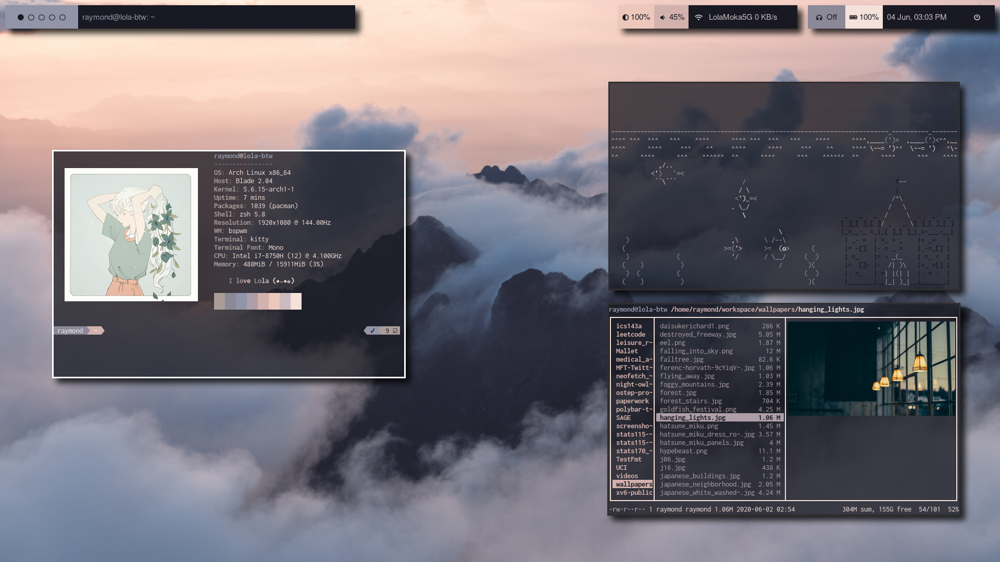
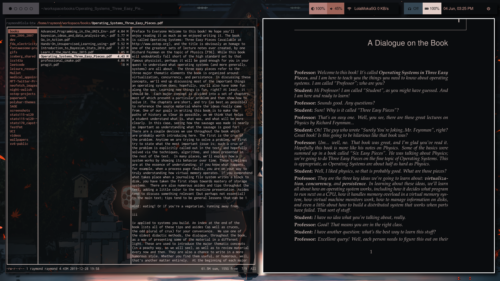

# Raymond's Dotfiles

My dotfiles managed with GNU Stow.




## Installation

**Warning**: If you decide to give my dotfiles a try, you should first review the configurations/code and remove the things you do not want or need. Don't use my settings if you're not sure what they entail!

### Prerequisites

* <a href="https://www.gnu.org/software/stow/">stow</a>

### Exports

In your ~/.zprofile:

``` zsh
export NEOFETCH_IMAGE_DIR="~/path/to/neofetch_images"
export WALLPAPER_DIR="~/path/to/wallpapers"
```

**NOTE**: My wallpapers and images are not included with this repository.

### Stow

The quickest way to place each dotfile in the right directory is to clone this repository into your home directory, change directories into the folder and run:

``` zsh
stow *
```

However you can individually stow each folder if you don't want to use all my preferred applications/configurations.

``` zsh
stow zsh
stow vim
stow bspwm
stow sxhkd
...
```

End with an example of getting some data out of the system or using it for a little demo

## Additional Steps

### Load Fonts

* Manually build your local fonts in order to prevent dropped characters in `polybar`.

``` zsh
fc-cache -vf
```

You may need additional fonts such as `powerline-fonts` or `meslo-nerd-fonts` in order to properly load my powerlevel-10k theme and vim status bar.

### Symlinking

In order to get `pywal` to color `dunst`, `zathura` and `discord`, you need additional symlinks from pywal's cache.

``` zsh
mkdir -p ~/.config/beautiful-discord
ln -s ~/.cache/wal/dunstrc ~/.config/dunst/dunstrc
ln -s ~/.cache/wal/zathurarc ~/.config/zathura/zathurarc
ln -s ~/.cache/wal/discord_pywal.css ~/.config/beautiful-discord/discord_pywal.css
```

Use `beautifuldiscord` to change Discord's colors.

``` zsh
beautifuldiscord --css ~/.config/beautiful-discord/discord_pywal.css
```

### Vim/Neovim

I use `vim-plug` to load my plugins. Open `~/.vimrc` and `vim-plug` should auto-install.

Just :PlugInstall and you're good to go!

**NOTE**: I alias'd `nvim` to be `vim` because of muscle memory.

### Navigation, Tips and Shortcuts

* Run `generate_all_pywal_cache.sh` to generate json caches of all your wallpaper colorschemes for faster loading in the future. It should be included in your path if you're following my config. If not its in `~/bin`.
* Press `super + F2` to view a list of keyboard maps to navigate and manipulate windows, take screenshots, create gifs, open applications, etc.
* `ctrl + super + n` to quickly change wallpapers and colorschemes.
* Left click the wifi module in `Polybar` to open `network manager dmenu` in `rofi`.
* Left click the bluetooth (headphones) module in `Polybar` to connect devices.
* Right click the bluetooth module to turn on bluetooth.

## Acknowledgments

* My vimrc is inspired by <a href="https://github.com/amix/vimrc">amix</a>.
* ngynLK and his <a href="https://github.com/ngynLk/polybar-themes">blocks theme</a>.
* adi1090x and his <a href="https://github.com/adi1090x">repositories</a>.
